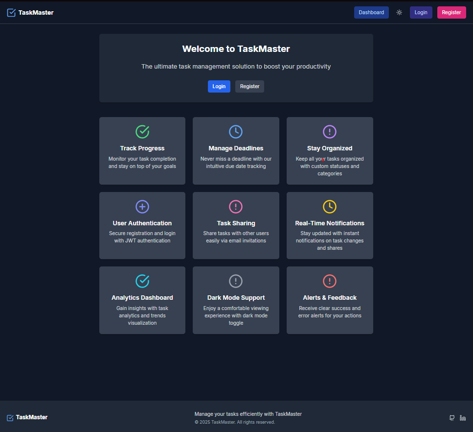
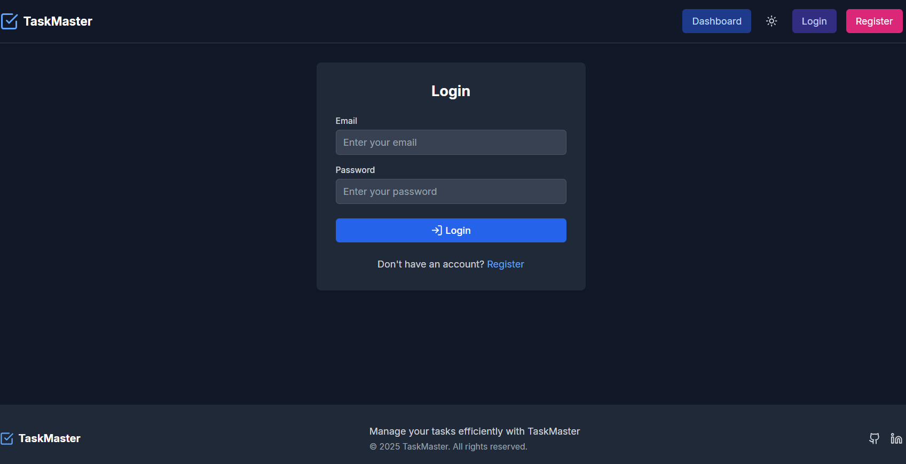
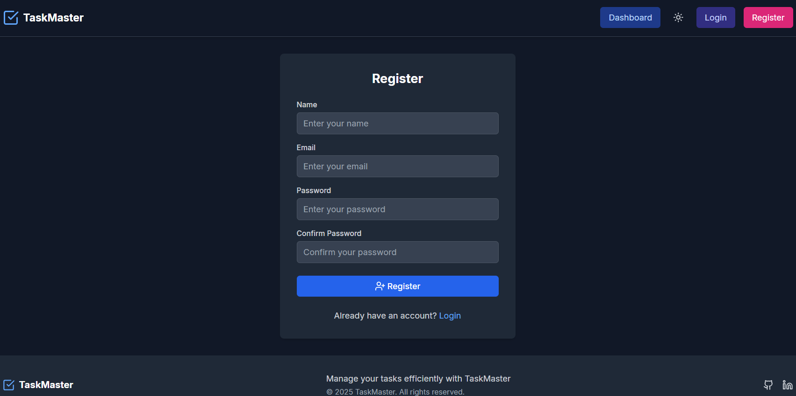
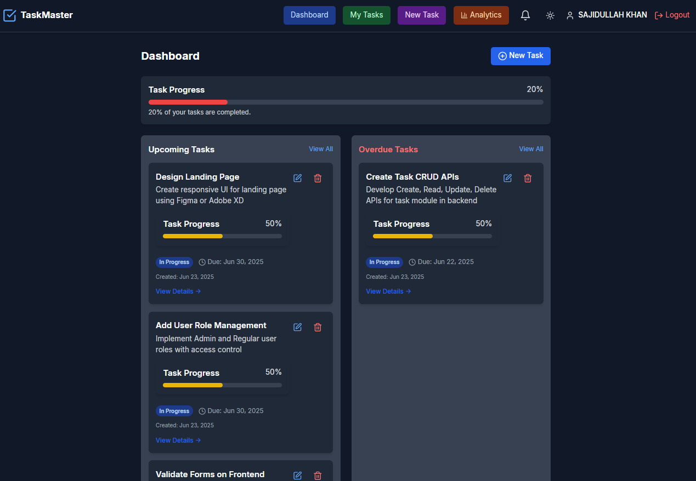
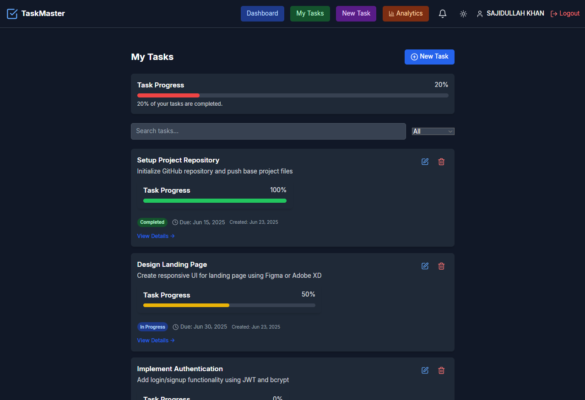
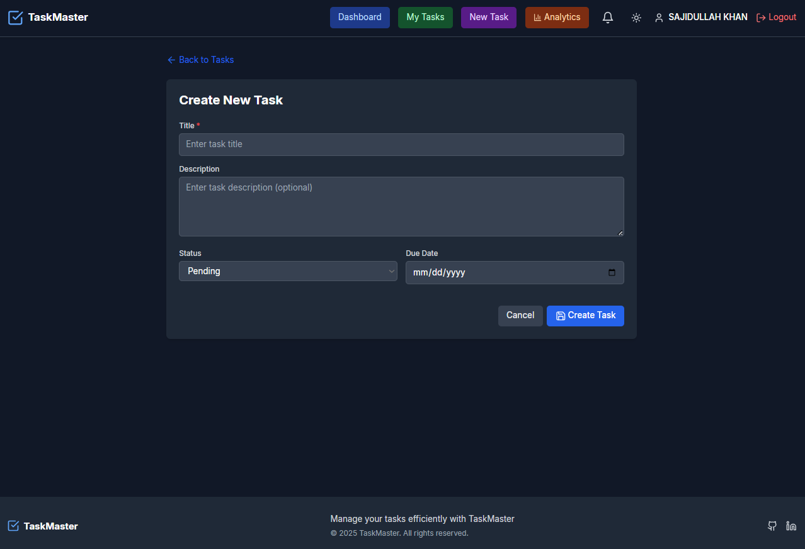
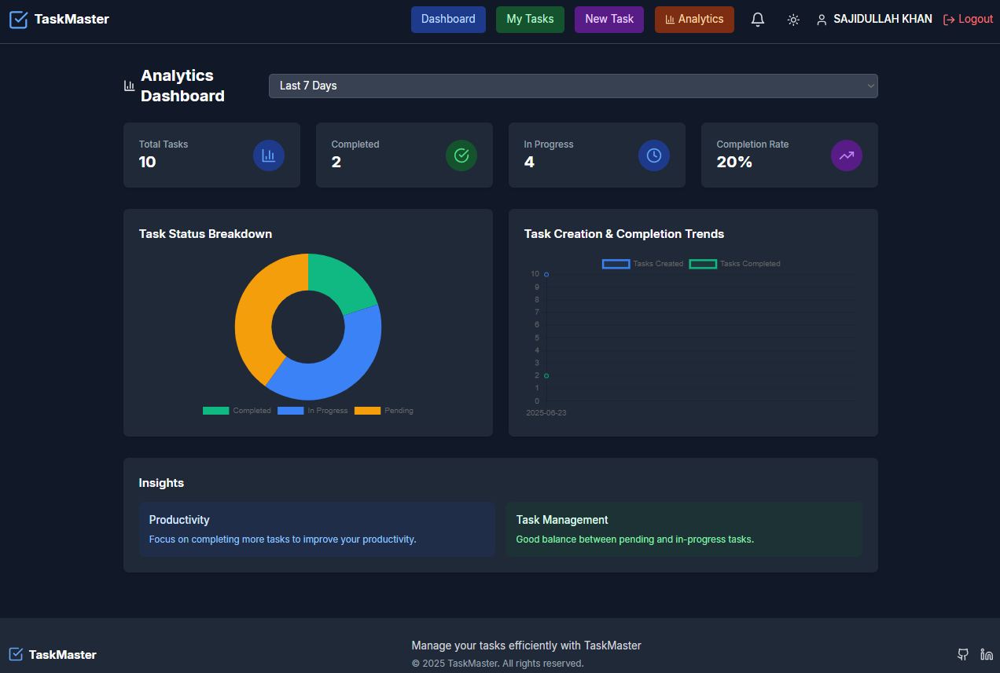
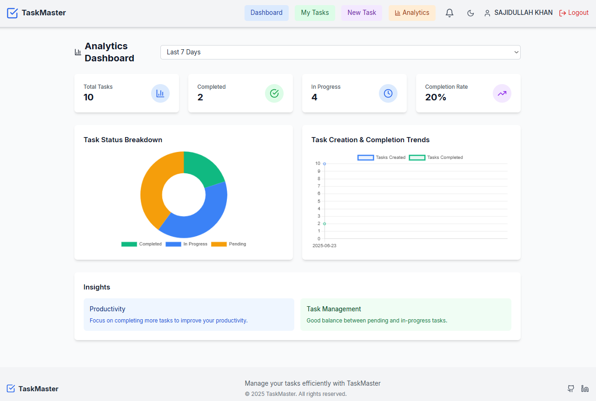

# Task Management System

A full-stack Task Management System developed as a learning internship project at DevelopersHub Corporation by Sajidullah Khan (ID: DHC-1508). This application enables users to efficiently manage tasks with features including creation, updating, deletion, filtering, searching, sharing, and real-time notifications.

---

## Author

**Sajidullah Khan**  
DeveloperHub Corporation  
ID: DHC-1508

---

## Live
[Task Management System](https://task-management-system-z6e4.vercel.app)


## Technologies Used

### Backend
- Node.js with Express.js
- MongoDB with Mongoose ODM
- express-validator for request validation
- express-async-handler for async error handling
- JSON Web Tokens (JWT) for secure authentication
- Socket.IO for real-time notifications

### Frontend
- React with TypeScript
- React Router for client-side routing
- React Context API for state management (AuthContext, TaskContext)
- Axios for HTTP requests
- Tailwind CSS with dark mode support (class strategy)
- Lucide React icons for UI elements

---

## Project Structure

```
/backend
  /config          # Database configuration
  /controllers     # API route controllers (taskController, userController)
  /middleware      # Authentication and error handling middleware
  /models          # Mongoose models (Task, User, Notification)
  /routes          # Express routes (taskRoutes, userRoutes)
  /utils           # Utility functions (e.g., token generation)
  server.js        # Backend server entry point
  package.json     # Backend dependencies and scripts
  package-lock.json # Backend dependencies lockfile

/frontend
  /src
    /components
      /common      # Common UI components (Alert)
      /layout      # Layout components (Header, Footer)
      /modals      # Modal components (ShareTaskModal)
      /notifications # Notification components (NotificationDropdown)
      /routing     # Route protection components (PrivateRoute)
      /tasks       # Task related components (TaskItem, TaskFilter, ProgressBar)
    /context       # React Context providers (AuthContext, TaskContext, NotificationContext, SocketContext, ThemeContext)
    /pages         # Application pages (Dashboard, Login, Register, TaskList, TaskForm, TaskDetails, AnalyticsDashboard)
    App.tsx        # Main React app component
    main.tsx       # React app entry point
  package.json     # Frontend dependencies and scripts
  tailwind.config.js
  postcss.config.js
```

---

## Key Features

- User registration, login, and profile management with JWT authentication
- Create, read, update, and delete tasks with ownership enforcement
- Filter tasks by status (Pending, In Progress, Completed)
- Search tasks by title or description
- Share tasks with other users by email with backend email-to-userID conversion
- Real-time notifications for task updates and sharing via Socket.IO
- Responsive UI with Tailwind CSS and dark mode support
- Task progress visualization with progress bar
- Protected routes ensuring only authenticated users access task data
- Alerts for success and error feedback

---

## Setup Instructions

### Backend Setup

1. Navigate to the backend directory:
   ```bash
   cd backend
   ```

2. Install dependencies:
   ```bash
   npm install
   ```

3. Create a `.env` file with the following variables:
   ```
   MONGO_URI=your_mongodb_connection_string
   JWT_SECRET=your_jwt_secret_key
   PORT=5000
   ```

4. Start the backend server:
   ```bash
   node server.js
   ```

### Frontend Setup

1. Navigate to the frontend directory:
   ```bash
   cd frontend
   ```

2. Install dependencies:
   ```bash
   npm install
   ```

3. Start the frontend development server:
   ```bash
   npm run dev
   ```

---

## API Documentation

All API endpoints require JWT authentication via the `Authorization` header as `Bearer <token>`.

| Endpoint               | Method | Description                          | Request Body Example                                  | Response Example                                  |
|------------------------|--------|------------------------------------|------------------------------------------------------|--------------------------------------------------|
| `/api/users`           | POST   | Register a new user                 | `{ "name": "John", "email": "john@example.com", "password": "password123" }` | User object with token                            |
| `/api/users/login`     | POST   | Authenticate user and get token    | `{ "email": "john@example.com", "password": "password123" }` | User object with token                            |
| `/api/users/profile`   | GET    | Get logged-in user profile          | N/A                                                  | User profile object                               |
| `/api/users/ids-by-emails` | POST | Get user IDs by emails (for sharing) | `{ "emails": ["user1@example.com", "user2@example.com"] }` | Array of user objects with `_id` and `email`     |
| `/api/tasks`           | GET    | Get all tasks for logged-in user    | N/A                                                  | Array of task objects                             |
| `/api/tasks/:id`       | GET    | Get a specific task by ID            | N/A                                                  | Task object                                      |
| `/api/tasks`           | POST   | Create a new task                   | `{ "title": "Task 1", "description": "Desc", "status": "Pending", "dueDate": "2024-12-31" }` | Created task object                              |
| `/api/tasks/:id`       | PUT    | Update an existing task             | `{ "title": "Updated Task", "status": "Completed" }` | Updated task object                              |
| `/api/tasks/:id`       | DELETE | Delete a task                      | N/A                                                  | `{ "message": "Task removed" }`                   |
| `/api/tasks/:id/share` | PUT    | Share a task with users             | `{ "userIds": ["userId1", "userId2"] }`              | Updated task object with shared users            |

---

## Screenshots

*







*

---

## Usage

- Open the frontend application in your browser (usually at `http://localhost:5173`).
- Register a new user or log in with existing credentials.
- Manage your tasks by creating, updating, deleting, filtering, and searching.
- Share tasks with other users by entering their email addresses.
- View task progress with the progress bar.
- Receive real-time notifications for task updates and sharing.
- The backend API handles all data persistence and authentication.

---

## Notes

- Ensure MongoDB is running and accessible via the connection string in `.env`.
- JWT secret should be kept secure and not shared publicly.
- Tailwind CSS is configured with dark mode support using the 'class' strategy.
- For development, sample tasks can be added via the frontend or directly in the database.
